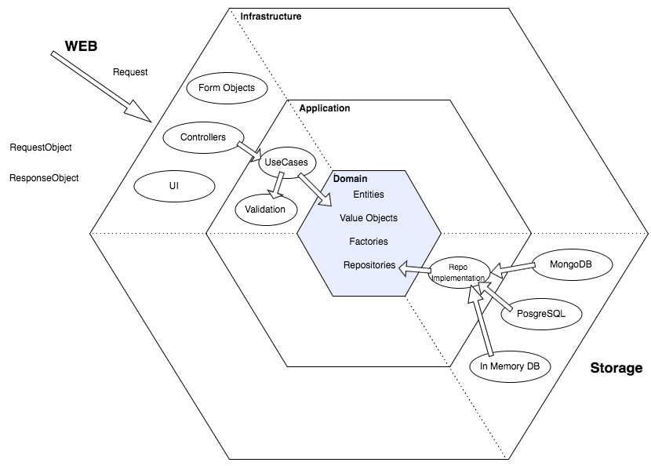
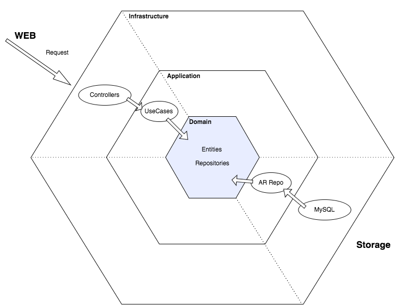

# README

This is my attempt to implement basic CRUD for User in Hexagonal way.

I was inspired by:
 - Jim Weirich's talk "Decoupling From Rails" (https://www.youtube.com/watch?v=tg5RFeSfBM4)
 - Uncle Bob's talk "Architecture the Lost Years" (https://www.youtube.com/watch?v=WpkDN78P884)
 - Ideas of Domain-Driven Design

So that's how I would like to implement my app eventually:

And that's what I implemented so far:

I try to keep 3 levels of abstraction:

### Core domain (domain folder):
In core domain I currently have Entity and Repository (as an interface).
Core domain could be pulled out into different repository and totally decoupled from Rails.
That's where DDD part lives so far (at least I think that way).

### Application Level (UseCases and Repositories in app folder):
In application level I have UseCases and they're totally decoupled from Rails stuff.
Repositories on application level implement interface expected in core domain level.

### Infrastructure Level (controllers and views)
Basic Rails MVC app that triggers use cases.

## TODO:

1. Create RequestObject as a wrapper around Rails params and use it in UseCases.
2. Add validation at least on two levels:
 - RequestObject level
 - UseCase or Entity level (still in progress with this one)
